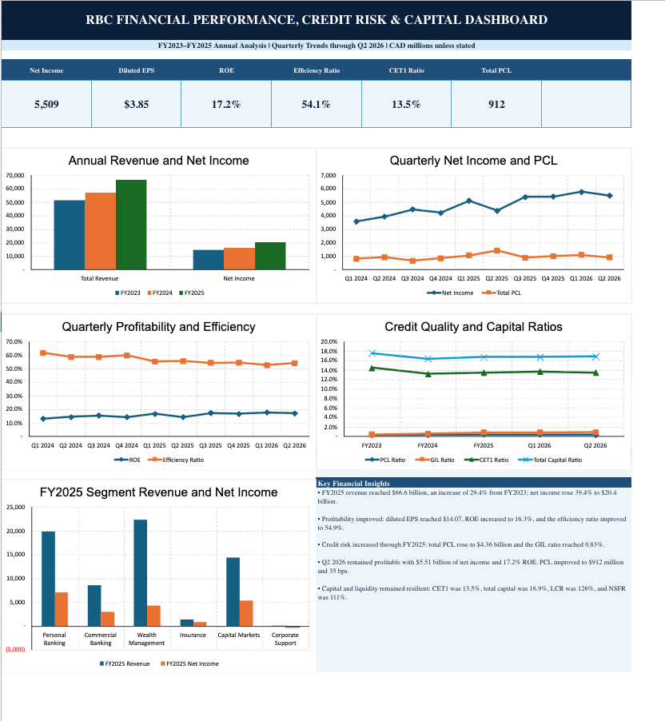
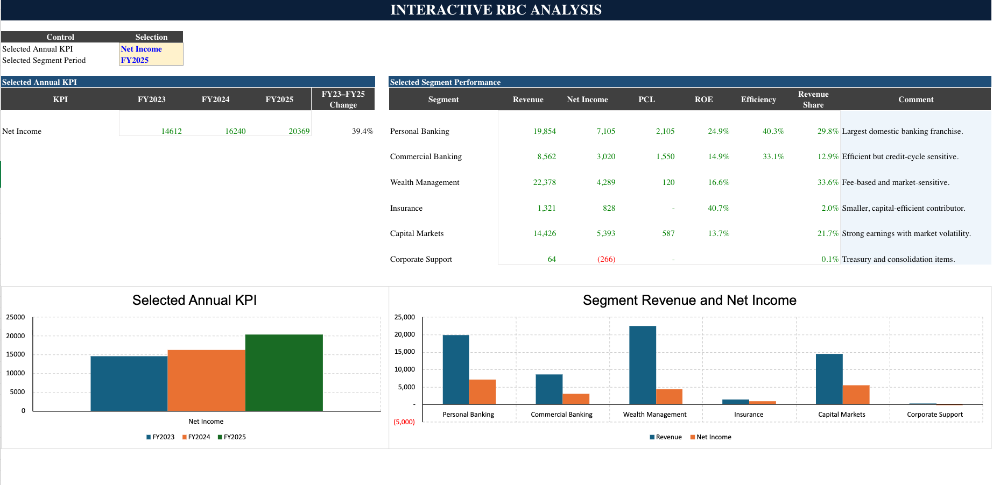
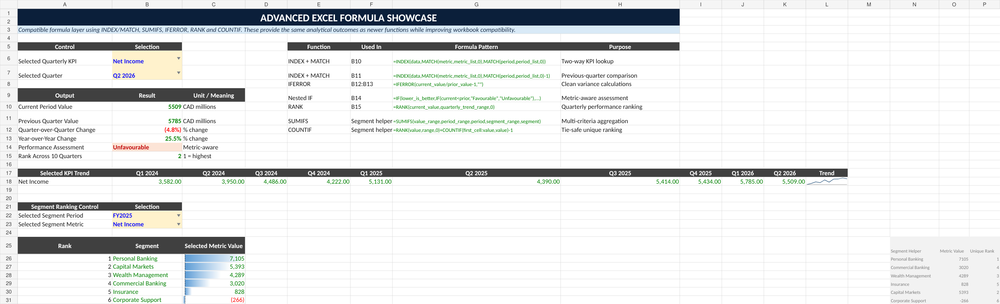
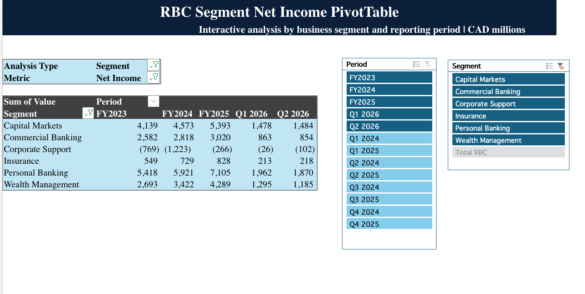

# Royal Bank of Canada Financial Analysis

An independent Excel-based finance and accounting portfolio project analyzing Royal Bank of Canada's financial performance, credit risk, capital adequacy, liquidity, and business-segment results.

## Download the Excel Model

[**Download RBC Banking Financial Analysis Workbook**](RBC_Banking_Financial_Analysis.xlsx)

## Project Overview

| Item | Details |
|---|---|
| Company | Royal Bank of Canada |
| Industry | Banking and Financial Services |
| Analysis period | FY2023–FY2025 and Q1 2024–Q2 2026 |
| Data cutoff | April 30, 2026 |
| Reporting currency | Canadian dollars |
| Reporting unit | CAD millions unless otherwise stated |
| Primary tool | Microsoft Excel |
| Project type | Independent Finance and Accounting Portfolio Project |
| Prepared by | Neha R K |

## Project Objective

The project evaluates RBC's financial performance, revenue composition, operating efficiency, credit risk, capital adequacy, liquidity, and business-segment performance using publicly available annual, quarterly, supplementary, and regulatory disclosures.

## Key Findings

- FY2025 revenue reached approximately **CAD 66.6 billion**.
- FY2025 net income reached approximately **CAD 20.4 billion**.
- FY2025 ROE improved to **16.3%**.
- The FY2025 efficiency ratio improved to **54.9%**.
- Credit costs and impaired loans increased through FY2025, indicating a more normalized credit cycle.
- Q2 2026 net income was approximately **CAD 5.5 billion**.
- RBC maintained a **13.5% CET1 ratio** and **126% LCR** in Q2 2026.
- Personal Banking remained the largest business-segment earnings contributor.

## Portfolio Screenshots

### Executive Dashboard

### Interactive RBC Analysis

### Advanced Excel Formula Showcase

### Native PivotTable with Slicers

## Excel Model Features

- Annual and quarterly performance analysis
- Balance-sheet analysis
- Credit-risk and asset-quality analysis
- Regulatory capital and liquidity analysis
- Business-segment analysis
- KPI calculations and trend interpretation
- Interactive dropdown-based analysis
- Advanced formulas using `INDEX`, `MATCH`, `SUMIFS`, `IFERROR`, `RANK`, and `COUNTIF`
- Normalized long-format PivotTable source
- Native PivotTable with slicers
- Dashboard charts and executive insights
- Formula-based reconciliation and data-audit checks
- Analyst commentary and source documentation

## Repository Files

| File | Description |
|---|---|
| [RBC_Banking_Financial_Analysis.xlsx](RBC_Banking_Financial_Analysis.xlsx) | Complete 26-sheet Excel financial-analysis model |
| [Project_Methodology.md](Project_Methodology.md) | Data collection, standardization, KPI calculation, and validation methodology |
| [KPI_Definitions.md](KPI_Definitions.md) | Definitions of major banking, profitability, credit-risk, capital, and liquidity KPIs |
| [Source_Register.md](Source_Register.md) | Official RBC public disclosures used in the analysis |
| [Workbook_Guide.md](Workbook_Guide.md) | Sheet-by-sheet guide to the Excel model |
| [DISCLAIMER.md](DISCLAIMER.md) | Project disclaimer and ownership statement |

## Workbook Navigation

The workbook contains 26 worksheets covering project setup, source documentation, raw data, standardized schedules, KPI analysis, dashboards, interactive analysis, advanced formulas, PivotTable data, and validation checks.

See the [Workbook Guide](Workbook_Guide.md).

## Methodology

The model follows a traceable workflow:

1. Collect official RBC public disclosures.
2. Record the documents in a source register.
3. Capture annual, quarterly, balance-sheet, risk, capital, liquidity, and segment data.
4. Standardize the data for consistent analysis.
5. Calculate financial and banking KPIs.
6. Build dashboards and interactive analysis.
7. Reconcile key totals and review formula errors.

See [Project Methodology](Project_Methodology.md).

## Data Sources

The analysis uses publicly available RBC Investor Relations materials, including annual reports, quarterly reports, financial supplements, Pillar 3 disclosures, and earnings releases.

See [Source Register](Source_Register.md).

## Skills Demonstrated

- Financial statement analysis
- Banking and credit-risk analysis
- Regulatory capital and liquidity analysis
- Microsoft Excel financial modelling
- Advanced Excel formulas
- PivotTables and slicers
- Dashboard creation
- Data standardization
- Reconciliation and quality control
- Financial commentary
- Source documentation

## How to Use the Workbook

1. Download [RBC_Banking_Financial_Analysis.xlsx](RBC_Banking_Financial_Analysis.xlsx).
2. Open the workbook in Microsoft Excel.
3. Review `01_Cover` and `02_Project_Charter`.
4. Open `19_Dashboard` for the executive overview.
5. Use `21_Interactive_Analysis` for dropdown-based analysis.
6. Review `22_Advanced_Excel` for the formula showcase.
7. Use `26_Native_PivotTable` for PivotTable and slicer analysis.
8. Review `25_Data_Audit` for reconciliation checks.

## Author

**Neha R K**  
Accounting and Finance | Professional Accounting | Financial Technology  
[LinkedIn Profile](https://www.linkedin.com/in/nehark/)

## Disclaimer

This is an independent educational portfolio project. It is not affiliated with or endorsed by Royal Bank of Canada and does not constitute investment advice. All company data was obtained from publicly available disclosures and remains subject to the original source documents.
